

  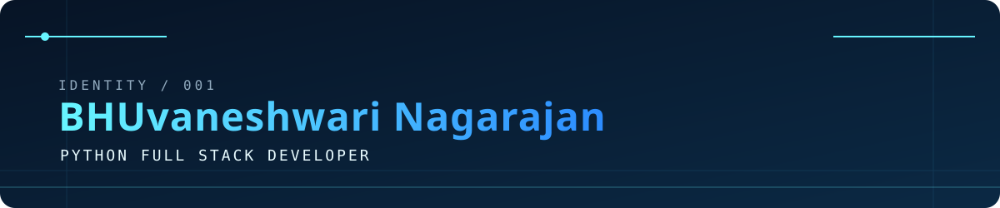
  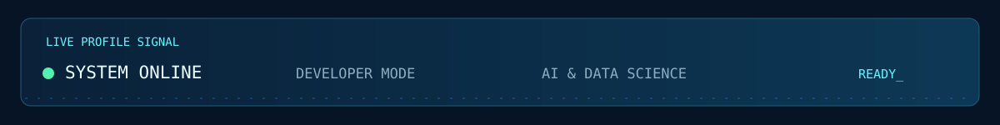

  <a href="https://bnfolio-dev.netlify.app/">Portfolio</a> ·
  <a href="https://github.com/bhuvaneshwari-nagarajan">GitHub</a> ·
  <a href="https://www.linkedin.com/in/bhuvaneshwari-nagarajan-b4252531b/">LinkedIn</a> ·
  <a href="mailto:bhuvaneshwarinagarajan3@gmail.com">Email</a>

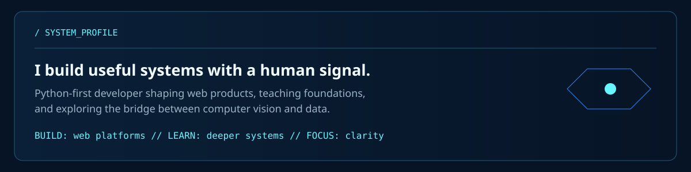

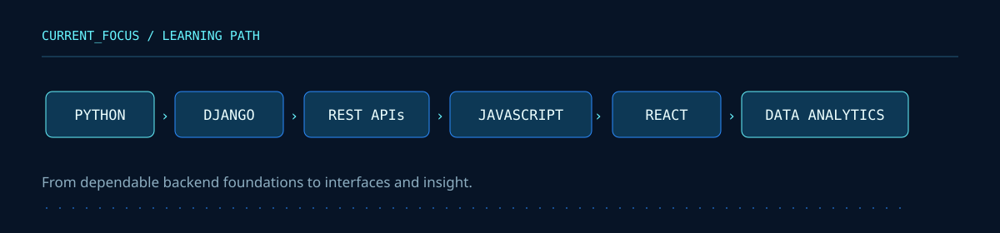

## Selected Builds

  <a href="https://github.com/bhuvaneshwari-nagarajan/AiCanvas-AI">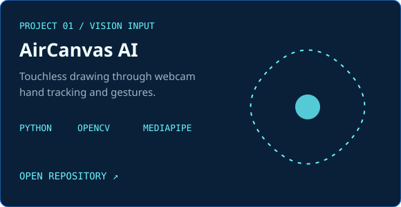</a>
  <a href="https://github.com/bhuvaneshwari-nagarajan/AI-Gesture-Based-Presentation-">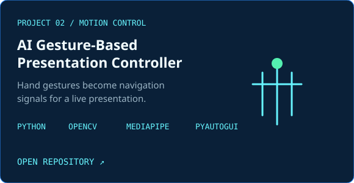</a>
  <a href="https://github.com/bhuvaneshwari-nagarajan/ResumeIQ">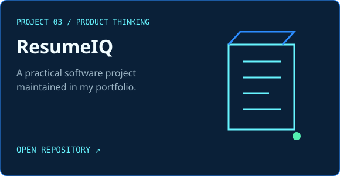</a>
  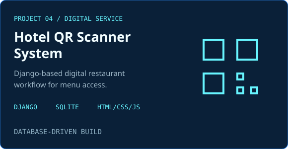
  <a href="https://bnfolio-dev.netlify.app/">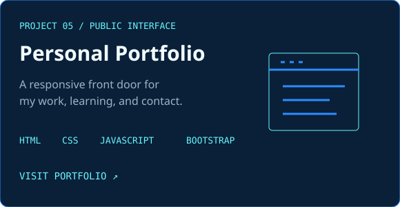</a>

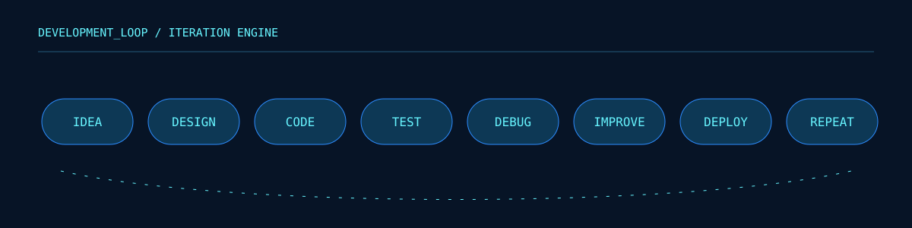

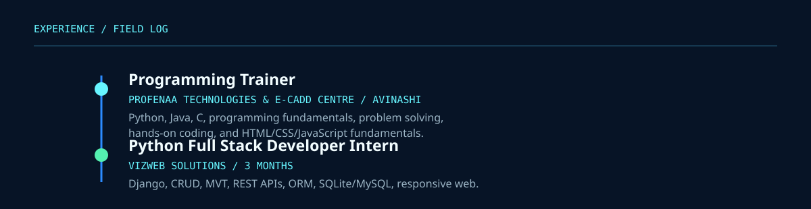

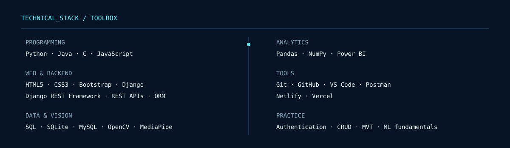

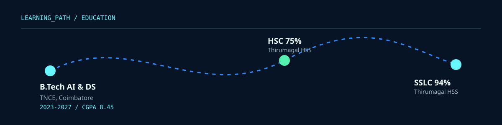

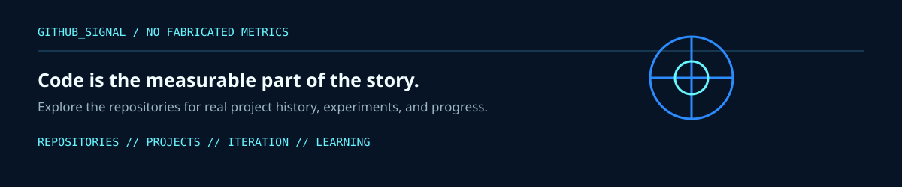

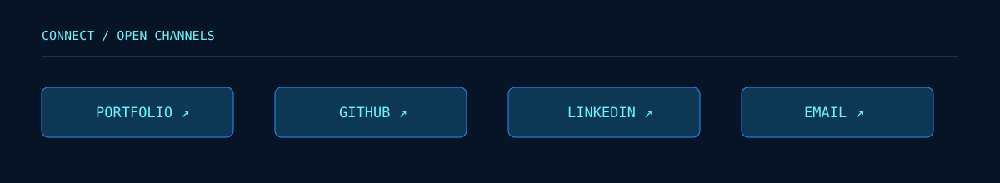

  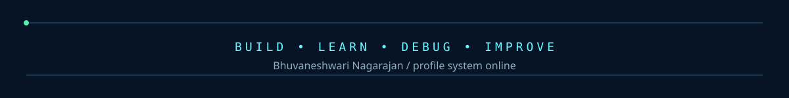

